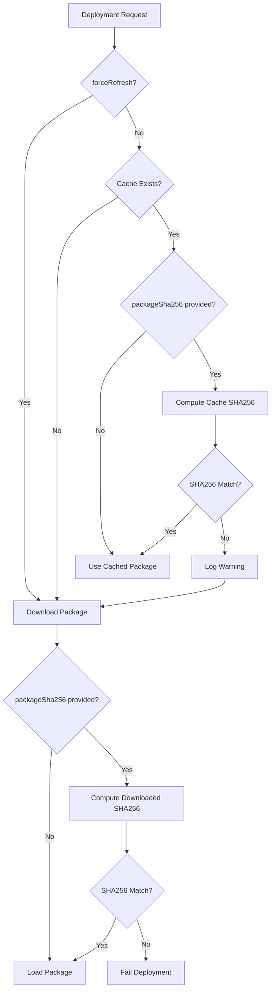

# Package Caching Implementation

## Overview

PAR implements a robust two-phase caching system for agent packages that balances performance with correctness:

- **Phase 1 (Implemented):** `forceRefresh` flag for development iteration
- **Phase 2 (Implemented):** SHA256-based cache validation for production integrity

## Architecture

### Cache Key Format
```
{packages_dir}/{agentAppId}@{version}.apkg
```

Example: `/tmp/pixell-runtime/packages/vivid-commenter@1.0.0.apkg`

### Decision Flow



## Phase 1: forceRefresh Flag

### Purpose
Allow developers to bypass cache during rapid iteration without changing version numbers.

### API Usage

```bash
curl -X POST http://par-endpoint/deploy \
  -H 'Content-Type: application/json' \
  -H 'Idempotency-Key: deployment-id' \
  -d '{
    "deploymentId": "deployment-id",
    "agentAppId": "my-agent",
    "orgId": "org-123",
    "packageUrl": "https://s3.../package.apkg",
    "version": "1.0.0",
    "forceRefresh": true
  }'
```

### Behavior
- `forceRefresh: true` → Always download, ignore cache
- `forceRefresh: false` (default) → Use cache if exists (Phase 1) or validate with SHA256 (Phase 2)

### Use Cases
- ✅ Development: Testing package changes without version bumps
- ✅ Debugging: Force fresh download to rule out cache issues
- ✅ Emergency: Override cache if suspected corruption

## Phase 2: SHA256 Validation

### Purpose
Ensure cached packages match expected content, detecting tampering or corruption.

### API Usage

```bash
# PAC computes SHA256 when uploading package
SHA256=$(sha256sum package.apkg | awk '{print $1}')

curl -X POST http://par-endpoint/deploy \
  -H 'Content-Type: application/json' \
  -H 'Idempotency-Key: deployment-id' \
  -d '{
    "deploymentId": "deployment-id",
    "agentAppId": "my-agent",
    "orgId": "org-123",
    "packageUrl": "https://s3.../package.apkg",
    "version": "1.0.0",
    "packageSha256": "'$SHA256'"
  }'
```

### Behavior

**Cache Hit:**
1. Compute SHA256 of cached file
2. Compare with provided `packageSha256`
3. If match → Use cache (logged as "Cache validated")
4. If mismatch → Re-download (logged as "Cache SHA256 mismatch")

**Download:**
1. Download package to cache
2. Compute SHA256 of downloaded file
3. Compare with provided `packageSha256`
4. If match → Continue deployment
5. If mismatch → **Fail deployment** (security/integrity violation)

### Use Cases
- ✅ Production: Verify package integrity
- ✅ Security: Detect tampering or corruption
- ✅ Compliance: Audit trail of package content
- ✅ Cache Correctness: Detect same-version updates

## Implementation Details

### SHA256 Computation

Located in `deploy/manager.py`:

```python
@staticmethod
def _compute_file_sha256(file_path: Path) -> str:
    """Compute SHA256 hash of a file."""
    import hashlib

    sha256_hash = hashlib.sha256()
    with open(file_path, "rb") as f:
        # Read file in chunks (8KB) to handle large files
        for byte_block in iter(lambda: f.read(8192), b""):
            sha256_hash.update(byte_block)
    return sha256_hash.hexdigest()
```

### Cache Logic

Located in `deploy/manager.py:_execute_deployment()`:

```python
# Check cache and decide whether to download
should_download = req.forceRefresh or not cache_file.exists()

if cache_file.exists() and not req.forceRefresh:
    # Phase 2: Validate SHA256 if provided
    if req.packageSha256:
        cached_sha256 = self._compute_file_sha256(cache_file)
        if cached_sha256 != req.packageSha256:
            should_download = True  # Cache invalid
        else:
            # Cache valid, use it
            pass
    else:
        # No SHA256 provided, trust cache
        pass

if should_download:
    fetch_package_to_path(location, cache_file)

    # Verify downloaded package
    if req.packageSha256:
        downloaded_sha256 = self._compute_file_sha256(cache_file)
        if downloaded_sha256 != req.packageSha256:
            # FAIL DEPLOYMENT - integrity violation
            rec.update_status(DeploymentStatus.FAILED, {...})
            return
```

## Logging

### Phase 1 Logs

**Force Refresh:**
```json
{
  "event": "Force refresh requested - bypassing cache",
  "deploymentId": "...",
  "level": "info"
}
```

**Cache Hit (No SHA256):**
```json
{
  "event": "Using cached package (no SHA256 validation)",
  "deploymentId": "...",
  "cache_file": "/tmp/...",
  "level": "info"
}
```

### Phase 2 Logs

**Cache Validated:**
```json
{
  "event": "Cache validated - using cached package",
  "deploymentId": "...",
  "sha256": "abc123...",
  "level": "info"
}
```

**Cache Mismatch:**
```json
{
  "event": "Cache SHA256 mismatch - re-downloading",
  "deploymentId": "...",
  "cached_sha256": "abc123...",
  "expected_sha256": "def456...",
  "level": "warning"
}
```

**Download Verified:**
```json
{
  "event": "Downloaded package SHA256 verified",
  "deploymentId": "...",
  "sha256": "abc123...",
  "level": "info"
}
```

**Download Failed Verification:**
```json
{
  "event": "Downloaded package SHA256 verification failed",
  "deploymentId": "...",
  "expected": "abc123...",
  "actual": "def456...",
  "level": "error"
}
```

## PAC Integration Requirements

### Phase 1 (Optional)
PAC can optionally send `forceRefresh: true` for developer convenience.

### Phase 2 (Recommended)
PAC should:

1. **On Package Upload:**
   ```python
   import hashlib

   def upload_package(apkg_path: str):
       # Compute SHA256
       sha256_hash = hashlib.sha256()
       with open(apkg_path, "rb") as f:
           for chunk in iter(lambda: f.read(8192), b""):
               sha256_hash.update(chunk)
       sha256 = sha256_hash.hexdigest()

       # Store SHA256 in package metadata
       # Upload to S3
       # Store SHA256 in database

       return sha256
   ```

2. **On Deployment Request:**
   ```python
   def create_deployment(package_id: str):
       # Retrieve package metadata
       package = get_package(package_id)

       return {
           "deploymentId": ...,
           "agentAppId": package.agent_app_id,
           "version": package.version,
           "packageUrl": package.url,
           "packageSha256": package.sha256,  # Include SHA256
           ...
       }
   ```

## Testing

### Test Phase 1: forceRefresh

```bash
# Deploy version 1.0.0
curl -X POST .../deploy -d '{"version":"1.0.0", "packageUrl":"..."}'

# Modify package in S3 (keep same URL)
# Deploy again WITHOUT forceRefresh - should use cache
curl -X POST .../deploy -d '{"version":"1.0.0", "packageUrl":"..."}'

# Deploy WITH forceRefresh - should download new version
curl -X POST .../deploy -d '{"version":"1.0.0", "packageUrl":"...", "forceRefresh":true}'
```

### Test Phase 2: SHA256 Validation

```bash
# Deploy with correct SHA256
SHA256=$(sha256sum package.apkg | awk '{print $1}')
curl -X POST .../deploy -d '{
  "version":"1.0.0",
  "packageUrl":"...",
  "packageSha256":"'$SHA256'"
}'

# Deploy again - cache should validate
curl -X POST .../deploy -d '{
  "version":"1.0.0",
  "packageUrl":"...",
  "packageSha256":"'$SHA256'"
}'

# Deploy with WRONG SHA256 - should fail
curl -X POST .../deploy -d '{
  "version":"1.0.0",
  "packageUrl":"...",
  "packageSha256":"wrong_hash_here"
}'
```

## Performance Considerations

### Cache Hit (No SHA256)
- **Time:** ~0ms (instant)
- **Network:** 0 bytes
- **CPU:** Minimal

### Cache Hit (With SHA256)
- **Time:** ~10-50ms (depends on package size)
- **Network:** 0 bytes
- **CPU:** SHA256 computation (fast for MB-sized files)

### Cache Miss
- **Time:** Download time + verification time
- **Network:** Full package download
- **CPU:** SHA256 computation

### Recommendation
- Use `forceRefresh: false` (default) in production
- Provide `packageSha256` for all production deployments
- Use `forceRefresh: true` only during development

## Security

### Threat Model

**Threat:** Malicious actor replaces package in cache
- **Mitigation:** SHA256 validation detects tampering
- **Result:** Deployment fails, security team alerted

**Threat:** Network MITM modifies package during download
- **Mitigation:** SHA256 validation after download
- **Result:** Deployment fails

**Threat:** Same version, different content (accidental or malicious)
- **Mitigation:** SHA256 mismatch triggers re-download
- **Result:** Correct version deployed

### Best Practices

1. **Always provide `packageSha256` in production**
2. **Store SHA256 in PAC database** when uploading packages
3. **Log all cache mismatches** for audit trail
4. **Alert on repeated SHA256 failures** (potential attack)
5. **Use HTTPS for package URLs** (SSL/TLS)

## Backward Compatibility

### Old Clients (No forceRefresh, No packageSha256)
- ✅ Work as before
- Cache used if version matches
- No SHA256 validation

### New Clients (forceRefresh only)
- ✅ Can bypass cache for development
- No SHA256 validation yet

### New Clients (With packageSha256)
- ✅ Full security and correctness
- Cache validated
- Download verified

## Metrics

Recommended metrics to track:

```python
# Cache performance
cache_hit_rate = cache_hits / (cache_hits + cache_misses)
cache_validation_time_p50 = ...
cache_validation_time_p99 = ...

# Security
sha256_mismatch_count = ...  # Alert if > 0 in production
force_refresh_count = ...    # High in dev, low in prod

# Performance
package_download_time_p50 = ...
package_download_size_p50 = ...
```

## Future Enhancements

### 1. Signed Packages
- PAC signs packages with private key
- PAR verifies signature with public key
- Stronger than SHA256 alone (proves authenticity)

### 2. Content-Based Addressing
- Use SHA256 as cache key instead of version
- Automatically handles same-version updates
- Requires PAC schema change

### 3. Distributed Cache
- Share cache across PAR instances
- Use Redis or S3 for cache storage
- Reduces bandwidth for multi-instance deployments

### 4. Cache Warming
- Pre-download popular packages
- Triggered by deployment patterns
- Reduces cold-start latency

## Support

For questions or issues:
- Check logs with `deploymentId` for detailed trace
- Verify `packageSha256` matches actual file
- Use `forceRefresh: true` to bypass cache for debugging
- File issues with cache behavior details and logs
