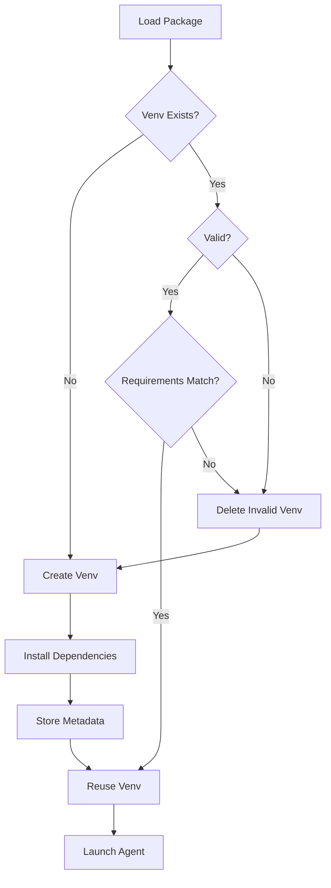

# Virtual Environment Isolation for Agent Packages

## Overview

PAR implements per-package virtual environment isolation to ensure each agent runs with its own dependencies, preventing version conflicts and ensuring reproducibility.

## Problem Statement

### Current Architecture Issues

1. **Shared Python Environment**: All agents share PAR's Python environment
2. **Dependency Conflicts**: Agent A needs grpcio==1.50.0, Agent B needs grpcio==1.73.1 → impossible
3. **No Isolation**: Agents can import each other's modules
4. **Version Lock**: Agents must use PAR's dependency versions (grpcio==1.60.0)
5. **No Reproducibility**: Agent behavior depends on PAR's environment, not agent's requirements.txt

### Real-World Impact

```
Deployment c02835a0-b070-4c50-9380-e03e04478df5:
- Agent's requirements.txt: grpcio==1.73.1
- PAR's environment: grpcio==1.60.0
- Agent runs with: grpcio==1.60.0 (PAR's version)
- Agent's gRPC stubs: Generated with old grpcio-tools
- Result: TypeError: _registered_method argument error
```

## Solution: Per-Package Virtual Environments

### Architecture

```
/tmp/pixell-runtime/
├── packages/                          # Downloaded APKG files
│   ├── vivid-commenter@1.0.0.apkg
│   └── my-agent@2.0.0.apkg
│
├── extracted/                         # Extracted package contents
│   ├── vivid-commenter@1.0.0/
│   │   ├── agent.yaml
│   │   ├── requirements.txt
│   │   └── src/
│   └── my-agent@2.0.0/
│       ├── agent.yaml
│       ├── requirements.txt
│       └── src/
│
└── venvs/                             # Virtual environments
    ├── vivid-commenter@1.0.0_a3f5b8c/  # SHA256 suffix
    │   ├── bin/python
    │   ├── bin/pip
    │   └── lib/python3.11/site-packages/
    │       ├── grpcio-1.73.1/
    │       └── fastapi-0.109.0/
    └── my-agent@2.0.0_d4e6c9a/
        ├── bin/python
        └── lib/python3.11/site-packages/
            └── grpcio-1.50.0/         # Different version, no conflict!
```

### Venv Naming Convention

```
{package_id}_{requirements_sha256_short}

Examples:
- vivid-commenter@1.0.0_a3f5b8c
- my-agent@2.0.0_d4e6c9a
```

**Why include SHA256?**
- Same package version with different requirements.txt → new venv
- Detects when requirements.txt changes
- Enables automatic venv rebuild on dependency updates

## Lifecycle

### 1. Package Download & Extraction

```python
# In deploy/manager.py::_execute_deployment()

# Download package (existing logic)
cache_file = packages_dir / f"{req.agentAppId}@{req.version}.apkg"
fetch_package_to_path(location, cache_file)

# Extract package (NEW)
extracted_path = extracted_dir / f"{req.agentAppId}@{req.version}"
extract_package(cache_file, extracted_path)
```

### 2. Requirements Hash Calculation

```python
# In agents/loader.py

def _calculate_requirements_hash(self, package_path: Path) -> str:
    """Calculate SHA256 hash of requirements.txt."""
    requirements_file = package_path / "requirements.txt"

    if not requirements_file.exists():
        return "no-deps"  # Package has no dependencies

    sha256_hash = hashlib.sha256()
    with open(requirements_file, "rb") as f:
        sha256_hash.update(f.read())

    return sha256_hash.hexdigest()[:7]  # Short hash (7 chars)
```

### 3. Virtual Environment Creation

```python
# In agents/loader.py

def _ensure_venv(self, package: AgentPackage, package_path: Path) -> Path:
    """Create or reuse virtual environment for package."""

    # Calculate requirements hash
    req_hash = self._calculate_requirements_hash(package_path)

    # Venv path
    venv_name = f"{package.id}_{req_hash}"
    venv_path = self.venvs_dir / venv_name

    # Check if venv already exists and is valid
    if venv_path.exists():
        if self._validate_venv(venv_path):
            logger.info("Reusing existing venv", venv=venv_name)
            return venv_path
        else:
            logger.warning("Invalid venv found, rebuilding", venv=venv_name)
            shutil.rmtree(venv_path)

    # Create new venv
    logger.info("Creating virtual environment", venv=venv_name)
    venv.create(venv_path, with_pip=True, clear=True)

    # Install requirements
    requirements_file = package_path / "requirements.txt"
    if requirements_file.exists():
        pip_path = venv_path / "bin" / "pip"

        logger.info("Installing dependencies", venv=venv_name)

        result = subprocess.run(
            [str(pip_path), "install", "-r", str(requirements_file)],
            capture_output=True,
            text=True,
            timeout=300  # 5 minutes max
        )

        if result.returncode != 0:
            raise PackageLoadError(
                f"Failed to install dependencies: {result.stderr}"
            )

        logger.info("Dependencies installed successfully", venv=venv_name)

    # Store venv metadata
    self._store_venv_metadata(venv_path, package, req_hash)

    return venv_path
```

### 4. Venv Validation

```python
def _validate_venv(self, venv_path: Path) -> bool:
    """Validate that venv is complete and functional."""

    # Check Python executable exists
    python_path = venv_path / "bin" / "python"
    if not python_path.exists():
        return False

    # Check venv can execute Python
    try:
        result = subprocess.run(
            [str(python_path), "-c", "import sys; print(sys.prefix)"],
            capture_output=True,
            text=True,
            timeout=5
        )

        if result.returncode != 0:
            return False

        # Verify it's using the venv (not system Python)
        if str(venv_path) not in result.stdout:
            return False

        return True

    except Exception:
        return False
```

### 5. Agent Subprocess Launch

```python
# In three_surface/runtime.py

async def start_rest_server(self):
    """Start REST server using venv Python."""

    # Get venv Python path
    venv_python = self.package.venv_path / "bin" / "python"

    # Build command with venv Python
    cmd = [
        str(venv_python),  # Use venv's Python!
        "-m", "uvicorn",
        f"{rest_module}:app",
        "--host", "0.0.0.0",
        "--port", str(self.rest_port),
        # ... other args
    ]

    self.rest_process = subprocess.Popen(cmd, ...)
```

## Caching Strategy

### Venv Reuse Logic



### Cache Key

```
venv_key = f"{package_id}_{requirements_sha256[:7]}"
```

### Venv Metadata

Store metadata in `{venv_path}/.pixell_venv_metadata.json`:

```json
{
  "package_id": "vivid-commenter@1.0.0",
  "requirements_sha256": "a3f5b8c9d2e1f4a7b6c5d4e3f2a1b0c9",
  "created_at": "2025-10-01T01:00:00Z",
  "python_version": "3.11.5",
  "installed_packages": {
    "grpcio": "1.73.1",
    "fastapi": "0.109.0",
    "uvicorn": "0.27.0"
  }
}
```

## Deployment Flow Integration

### Modified Deployment Flow

```python
# In deploy/manager.py::_execute_deployment()

async def _execute_deployment(self, req: DeploymentRequest, rec: DeploymentRecord):
    # 1. Download package (with caching & SHA256 validation)
    cache_file = await self._download_package(req)

    # 2. Extract package
    extracted_path = await self._extract_package(cache_file, req)

    # 3. Load package (creates/reuses venv)
    package = self.package_loader.load_package(
        apkg_path=cache_file,
        extracted_path=extracted_path
    )

    # 4. Package now has venv_path attribute
    rec.venv_path = str(package.venv_path)

    # 5. Start runtime with venv
    await self._start_runtime(package, rec)
```

### When Venv is Rebuilt

**Automatic Rebuild:**
1. New package version deployed → New venv created
2. Same version, different requirements.txt → New venv created (different hash)
3. Invalid/corrupted venv detected → Rebuild
4. `forceRefresh: true` + `rebuildVenv: true` flag → Force rebuild

**Venv is Reused:**
1. Same package version + same requirements.txt → Reuse existing venv
2. Redeploy same deployment → Reuse venv

## Performance Optimization

### Cold Start Performance

**Without Venv (Current):**
- Extract package: ~0.5s
- Add to sys.path: ~0.01s
- **Total: ~0.5s**

**With Venv (New):**
- Extract package: ~0.5s
- Create venv: ~2-3s
- Install dependencies: ~10-60s (depends on packages)
- **Total: ~15-65s** (first time)
- **Total: ~0.5s** (cached venv)

### Optimization Strategies

#### 1. Parallel Venv Creation

```python
# Create venv during package download
async def _execute_deployment(self, req: DeploymentRequest, rec: DeploymentRecord):
    # Start download
    download_task = asyncio.create_task(self._download_package(req))

    # Wait for download
    cache_file = await download_task

    # Extract and build venv in parallel with status updates
    extract_task = asyncio.create_task(self._extract_package(cache_file))
    extracted_path = await extract_task

    # Build venv with progress updates
    rec.update_status(DeploymentStatus.BUILDING_ENV)
    package = await self._load_package_with_venv(extracted_path)

    # Continue deployment...
```

#### 2. Pip Cache

```python
# Use shared pip cache across all venvs
pip_cache_dir = Path("/tmp/pixell-runtime/pip-cache")

subprocess.run([
    str(pip_path), "install",
    "--cache-dir", str(pip_cache_dir),  # Shared cache
    "-r", str(requirements_file)
])
```

#### 3. Pre-build Common Venvs

```python
# Pre-build venvs for common agent templates
COMMON_REQUIREMENTS = [
    "grpcio==1.73.1\nfastapi==0.109.0\nuvicorn==0.27.0",
    "grpcio==1.60.0\nfastapi==0.109.0\nuvicorn==0.27.0",
]

async def warmup_common_venvs():
    """Pre-build common dependency sets."""
    for req_content in COMMON_REQUIREMENTS:
        req_hash = hashlib.sha256(req_content.encode()).hexdigest()[:7]
        venv_name = f"warmup_{req_hash}"
        # Build venv...
```

#### 4. Venv Eviction (LRU)

```python
class VenvCache:
    """LRU cache for virtual environments."""

    def __init__(self, max_venvs: int = 50, max_size_gb: int = 10):
        self.max_venvs = max_venvs
        self.max_size_gb = max_size_gb
        self.venvs_dir = Path("/tmp/pixell-runtime/venvs")

    def evict_if_needed(self):
        """Remove oldest unused venvs if limits exceeded."""
        venvs = []

        for venv_path in self.venvs_dir.iterdir():
            if not venv_path.is_dir():
                continue

            # Get last access time and size
            metadata = self._load_metadata(venv_path)
            stat = venv_path.stat()

            venvs.append({
                "path": venv_path,
                "atime": stat.st_atime,
                "size": self._get_dir_size(venv_path),
                "metadata": metadata
            })

        # Sort by access time (oldest first)
        venvs.sort(key=lambda x: x["atime"])

        # Check limits
        total_size = sum(v["size"] for v in venvs) / (1024**3)  # GB

        # Evict oldest until under limits
        while len(venvs) > self.max_venvs or total_size > self.max_size_gb:
            oldest = venvs.pop(0)
            logger.info("Evicting venv", venv=oldest["path"].name)
            shutil.rmtree(oldest["path"])
            total_size -= oldest["size"] / (1024**3)
```

## Storage Management

### Disk Space Estimation

**Per Venv:**
- Empty venv: ~10MB
- With grpcio + fastapi + uvicorn: ~80MB
- With numpy + pandas: ~200MB
- With torch (CPU): ~800MB
- With transformers + torch: ~2GB

**For Multi-Agent Runtime:**
- 10 light agents: ~1GB
- 50 light agents: ~4GB
- 100 light agents: ~8GB
- 10 ML agents: ~10-20GB

### Storage Limits (Configurable)

```python
# In core/config.py

class Settings(BaseSettings):
    # ... existing settings ...

    # Venv cache settings
    MAX_VENVS: int = 50
    MAX_VENV_CACHE_SIZE_GB: int = 10
    VENV_EVICTION_POLICY: str = "lru"  # lru, lfu, fifo

    # Venv build settings
    VENV_INSTALL_TIMEOUT_SECONDS: int = 300
    PIP_CACHE_DIR: str = "/tmp/pixell-runtime/pip-cache"
```

### Monitoring

```python
# Expose metrics
venv_cache_size_bytes = Gauge(
    "par_venv_cache_size_bytes",
    "Total size of venv cache in bytes"
)

venv_count = Gauge(
    "par_venv_count",
    "Number of cached venvs"
)

venv_build_duration_seconds = Histogram(
    "par_venv_build_duration_seconds",
    "Time to build venv",
    buckets=[1, 5, 10, 30, 60, 120, 300]
)
```

## Security Considerations

### Isolation Benefits

1. **Dependency Isolation**: Agent A cannot import Agent B's packages
2. **Version Control**: Each agent runs with exact pinned versions
3. **Malicious Packages**: Compromised dependency in Agent A doesn't affect Agent B
4. **Audit Trail**: Know exactly what's installed in each agent's environment

### Security Enhancements

#### 1. Dependency Hash Validation

```python
# In requirements.txt (agent package)
grpcio==1.73.1 --hash=sha256:abc123...
fastapi==0.109.0 --hash=sha256:def456...
```

```python
# Install with hash verification
subprocess.run([
    str(pip_path), "install",
    "--require-hashes",  # Enforce hash verification
    "-r", str(requirements_file)
])
```

#### 2. Network Isolation During Install

```python
# Only allow PyPI (no arbitrary URLs)
subprocess.run([
    str(pip_path), "install",
    "--index-url", "https://pypi.org/simple",
    "--no-deps",  # Install deps separately with verification
    "-r", str(requirements_file)
])
```

#### 3. Package Allowlist/Denylist

```python
BLOCKED_PACKAGES = [
    "os-sys",  # Known malicious
    "setup-tools-rust",  # Typosquatting
]

def validate_requirements(requirements_file: Path):
    """Check for blocked packages."""
    with open(requirements_file) as f:
        for line in f:
            package = line.split("==")[0].strip()
            if package.lower() in BLOCKED_PACKAGES:
                raise SecurityError(f"Blocked package: {package}")
```

## Error Handling

### Common Errors

#### 1. Venv Creation Failure

```python
try:
    venv.create(venv_path, with_pip=True, clear=True)
except Exception as e:
    rec.update_status(
        DeploymentStatus.FAILED,
        {"error": f"Failed to create venv: {str(e)}"}
    )
    raise
```

#### 2. Dependency Installation Failure

```python
result = subprocess.run([pip_path, "install", "-r", requirements_file], ...)

if result.returncode != 0:
    # Parse error
    error_msg = result.stderr

    # Common errors
    if "No matching distribution" in error_msg:
        error = "Package not found in PyPI"
    elif "incompatible" in error_msg:
        error = "Dependency conflict detected"
    else:
        error = error_msg

    rec.update_status(
        DeploymentStatus.FAILED,
        {"error": f"Dependency installation failed: {error}"}
    )
    raise
```

#### 3. Disk Space Exhausted

```python
def check_disk_space(required_mb: int = 500):
    """Check if enough disk space available."""
    stat = shutil.disk_usage("/tmp")
    free_mb = stat.free / (1024 * 1024)

    if free_mb < required_mb:
        raise DiskSpaceError(
            f"Insufficient disk space: {free_mb}MB free, {required_mb}MB required"
        )
```

### Recovery Strategies

1. **Corrupted Venv**: Auto-delete and rebuild
2. **Disk Full**: Trigger aggressive eviction, retry
3. **Network Timeout**: Retry with exponential backoff
4. **Dependency Conflict**: Report clear error to user with suggestions

## Logging

### Venv Lifecycle Events

```json
// Venv creation started
{
  "event": "Creating virtual environment",
  "venv": "vivid-commenter@1.0.0_a3f5b8c",
  "package_id": "vivid-commenter@1.0.0",
  "requirements_sha256": "a3f5b8c9d2e1f4a7b6c5d4e3f2a1b0c9",
  "level": "info"
}

// Dependencies installing
{
  "event": "Installing dependencies",
  "venv": "vivid-commenter@1.0.0_a3f5b8c",
  "requirements_file": "/tmp/.../requirements.txt",
  "level": "info"
}

// Dependencies installed
{
  "event": "Dependencies installed successfully",
  "venv": "vivid-commenter@1.0.0_a3f5b8c",
  "duration_seconds": 45.2,
  "installed_packages": ["grpcio==1.73.1", "fastapi==0.109.0"],
  "level": "info"
}

// Venv reused
{
  "event": "Reusing existing venv",
  "venv": "vivid-commenter@1.0.0_a3f5b8c",
  "age_hours": 2.5,
  "level": "info"
}

// Venv evicted
{
  "event": "Evicting venv",
  "venv": "old-agent@1.0.0_xyz123",
  "reason": "lru_eviction",
  "last_used": "2025-09-30T12:00:00Z",
  "level": "info"
}
```

## API Extensions

### New Deployment Request Fields

```python
class DeploymentRequest(BaseModel):
    # ... existing fields ...

    # Venv control
    rebuildVenv: Optional[bool] = False  # Force rebuild even if exists
    skipVenvCache: Optional[bool] = False  # Don't reuse cached venv
    pipIndexUrl: Optional[str] = None  # Custom PyPI index
    pipExtraIndexUrl: Optional[str] = None  # Additional PyPI index
    pipTrustedHost: Optional[str] = None  # Trust specific host
```

### New Deployment Status

```python
class DeploymentStatus(str, Enum):
    # ... existing statuses ...
    BUILDING_ENV = "building_env"  # Creating venv
    INSTALLING_DEPS = "installing_deps"  # Installing dependencies
```

### Deployment Info Response

```json
{
  "deploymentId": "c02835a0-b070-4c50-9380-e03e04478df5",
  "status": "healthy",
  "venv": {
    "path": "/tmp/pixell-runtime/venvs/vivid-commenter@1.0.0_a3f5b8c",
    "requirements_sha256": "a3f5b8c9d2e1f4a7b6c5d4e3f2a1b0c9",
    "created_at": "2025-10-01T01:00:00Z",
    "python_version": "3.11.5",
    "installed_packages": {
      "grpcio": "1.73.1",
      "fastapi": "0.109.0"
    },
    "cached": true
  }
}
```

## Testing

### Unit Tests

```python
# tests/test_venv_isolation.py

async def test_venv_creation():
    """Test venv is created correctly."""
    loader = PackageLoader(packages_dir)
    package = loader.load_package(sample_apkg)

    assert package.venv_path.exists()
    assert (package.venv_path / "bin" / "python").exists()

async def test_venv_reuse():
    """Test venv is reused when requirements unchanged."""
    loader = PackageLoader(packages_dir)

    # First load
    package1 = loader.load_package(sample_apkg)
    venv_path1 = package1.venv_path
    created_time1 = venv_path1.stat().st_ctime

    # Second load (same package)
    package2 = loader.load_package(sample_apkg)
    venv_path2 = package2.venv_path
    created_time2 = venv_path2.stat().st_ctime

    # Should be same venv
    assert venv_path1 == venv_path2
    assert created_time1 == created_time2

async def test_venv_rebuild_on_requirements_change():
    """Test venv is rebuilt when requirements.txt changes."""
    loader = PackageLoader(packages_dir)

    # First load
    package1 = loader.load_package(sample_apkg)
    venv1 = package1.venv_path.name

    # Modify requirements.txt
    modify_package_requirements(sample_apkg, "grpcio==1.50.0")

    # Second load
    package2 = loader.load_package(sample_apkg)
    venv2 = package2.venv_path.name

    # Should be different venv
    assert venv1 != venv2

async def test_dependency_isolation():
    """Test agents have isolated dependencies."""
    # Deploy agent A with grpcio==1.50.0
    package_a = deploy_agent(agent_a_apkg)

    # Deploy agent B with grpcio==1.73.1
    package_b = deploy_agent(agent_b_apkg)

    # Check agent A has 1.50.0
    result_a = subprocess.run(
        [package_a.venv_path / "bin" / "python", "-c",
         "import grpcio; print(grpcio.__version__)"],
        capture_output=True, text=True
    )
    assert "1.50.0" in result_a.stdout

    # Check agent B has 1.73.1
    result_b = subprocess.run(
        [package_b.venv_path / "bin" / "python", "-c",
         "import grpcio; print(grpcio.__version__)"],
        capture_output=True, text=True
    )
    assert "1.73.1" in result_b.stdout
```

### Integration Tests

```bash
# Test full deployment flow with venv
./scripts/test_venv_deployment.sh

# Test venv eviction
./scripts/test_venv_eviction.sh

# Test performance
./scripts/benchmark_venv_performance.sh
```

## Migration Plan

### Phase 1: Implementation (Week 1)

1. Update `agents/loader.py`:
   - Add venv creation logic
   - Add requirements hash calculation
   - Add venv validation

2. Update `three_surface/runtime.py`:
   - Use venv Python for subprocess
   - Update all subprocess.Popen calls

3. Add venv cache management:
   - LRU eviction
   - Disk space monitoring

### Phase 2: Testing (Week 2)

1. Unit tests for venv isolation
2. Integration tests for deployment flow
3. Performance benchmarks
4. Load testing with multiple agents

### Phase 3: Rollout (Week 3)

1. Deploy to staging
2. Monitor venv cache size
3. Tune eviction parameters
4. Deploy to production

### Backward Compatibility

**Old agents (no requirements.txt):**
- Create empty venv with no deps
- Still isolated, just uses system packages via venv

**Existing deployments:**
- Continue running with current environment
- Redeploy to get venv isolation

## Future Enhancements

### 1. Python Version per Agent

```yaml
# agent.yaml
runtime:
  python_version: "3.11"  # or "3.9", "3.10", "3.12"
```

```python
# Create venv with specific Python version
venv.create(venv_path, with_pip=True, python_exe=f"/usr/bin/python{version}")
```

### 2. Conda/Mamba Support

For ML agents needing CUDA, system libraries:

```yaml
# agent.yaml
runtime:
  env_manager: "conda"  # or "venv" (default)
  conda_env: "environment.yml"
```

### 3. Shared Dependency Layers

Layer common dependencies to save space:

```
/tmp/pixell-runtime/
└── layers/
    ├── grpcio-1.73.1/       # Shared by multiple agents
    └── torch-2.0.0/
```

### 4. Pre-built Venvs

PAC could pre-build venvs and upload with package:

```
package.apkg
package.venv.tar.gz  # Pre-built venv
```

## Summary

### Benefits

✅ **Dependency Isolation**: Each agent has own dependencies
✅ **Version Freedom**: Different agents can use different versions
✅ **Reproducibility**: Agent runs with exact requirements.txt
✅ **Security**: No cross-agent dependency access
✅ **Compatibility**: Solves grpcio version mismatch
✅ **Industry Standard**: Matches Lambda, Docker, K8s patterns

### Trade-offs

⚠️ **Disk Space**: ~50-100MB per agent (mitigated with eviction)
⚠️ **Cold Start**: +10-60s first deploy (mitigated with caching)
⚠️ **Complexity**: More moving parts (manageable with good design)

### Recommendation

**Implement per-package virtual environments** as the fundamental solution for agent isolation in PAR. This is the correct architectural choice for a production multi-agent runtime.
